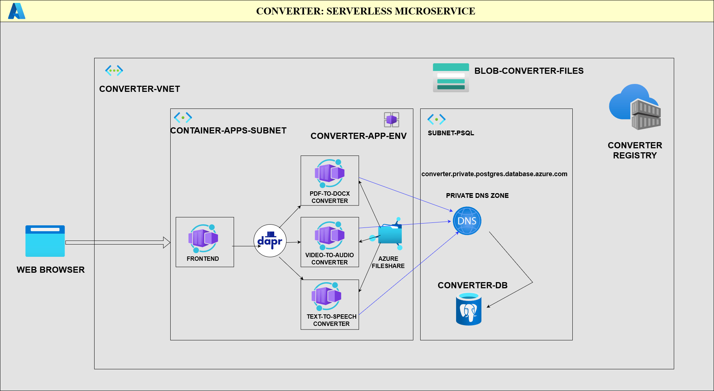
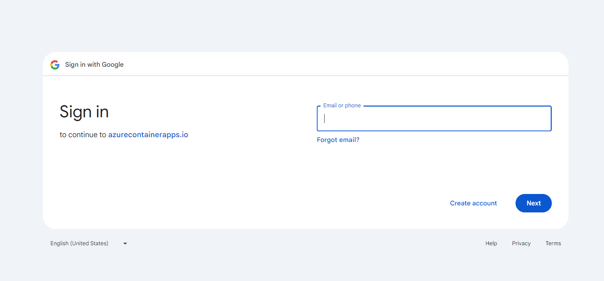
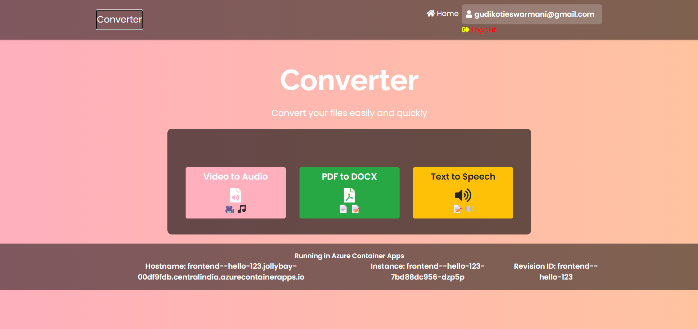
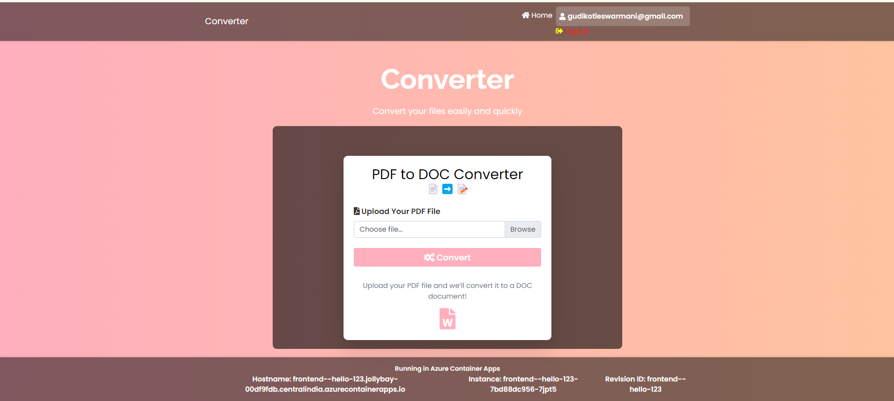
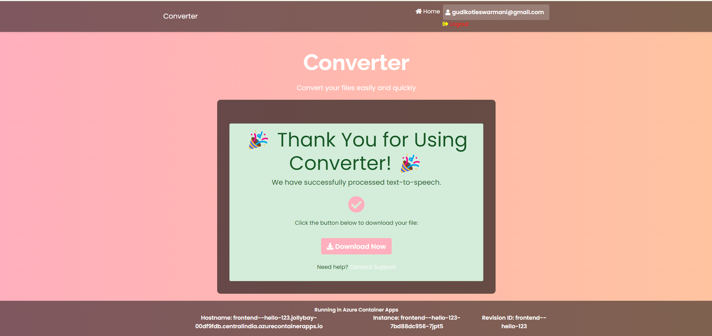

# SERVERLESS MICROSERVICES DEPLOYMENT IN AZURE
**In today’s rapidly evolving tech landscape, serverless architectures are gaining immense popularity. Companies are increasingly adopting serverless services to focus on coding and innovation rather than managing infrastructure. I’m excited to share a deep dive into my latest project that embraces this shift: Serverless Microservices in Azure. 🌟**

## 🌐 Project Overview

### Components
1. **Frontend:**
   - The user interface is crafted to provide a seamless experience. It interacts with various backend services to perform operations and display results.

2. **Text-to-Speech Service:**
    - Converts user-provided text into speech.
    - The output is uploaded to **Azure Blob Storage.**
    - Generates a **Shared Access Signature (SAS)** for secure, time-limited access to the audio file.

3. **PDF-to-DOCX Service:**
    - Handles conversion of PDF files to DOCX format.
    - Stores the converted files in **Azure Blob Storage.**
    - Provides a SAS for users to download the file within a defined time frame.

4. **Video-to-Audio Service:**
    - Transforms video files into audio.
    - Uploads the audio files to **Azure Blob Storage.**
    - Issues a SAS to ensure secure access for a limited time.

### 🔧 Key Technologies and Services
-  **Dapr (Distributed Application Runtime):**
    - Facilitates service discovery and invocation, simplifying the development of microservices by abstracting away the complexities of the underlying infrastructure.
- **Azure File Shares:**
    - Ensures persistent and accessible file storage across all microservices, enhancing distributed storage file system.
- **Azure PostgreSQL Flexible Server:**
    -   Manages transactional data, such as usage statistics and signed URL records, providing valuable insights into user interactions and system performance.
- **Authentication with Google Sign-In:**
    - Implements secure authentication, ensuring that only authorized users can access the services.
- **Azure Container Apps:**
    - Deploys all microservices in a serverless environment, which simplifies the deployment and scaling of containerized applications.
- **Azure Blog Storage:**
    - Stores conversion outputs and allows to create a shared access signature (SAS) URL for users to download the file within a limited time.

### WEBSITE IMAGES
**Project Architecture**


**Google sign in page**


**Home Page**


**Pdf-to-docx-converter page**


**Download page**



#### Steps to deploy 
- **Step1**: First clone this repo to your local workstation 
```bash
git clone https://github.com/Gkemhcs/converter-project-azure-serverless.git
cd converter-project-azure-serverless
```
- **Step2:** Then first create a resource group and azure container registry to store our docker artifacts 
```bash
az group create  --name  converter-demo
az config set defaults.group=converter-demo
echo "Enter a unique name for azure registry"
read ACR_NAME
az acr create --name $ACR_NAME
```

- **Step3:** Then now we need to build and push images to azure container registry
```bash
az acr login --name  $ACR_NAME
cd frontend 
export IMAGE_SUFFIX=$ACR_NAME.azurecr.io/services
docker build -t $IMAGE_SUFFIX/frontend .
docker image push $IMAGE_SUFFIX/frontend 
cd ../pdf-to-docx-converter
docker build -t $IMAGE_SUFFIX/pdf-to-docx-converter .
docker image push $IMAGE_SUFFIX/pdf-to-docx-converter
cd ../text-to-speech-converter
docker build -t $IMAGE_NAME/text-to-speech-converter .
docker  image push $IMAGE_NAME/text-to-speech-converter
cd ../video-to-audio-converter
docker build -t $IMAGE_NAME/video-to-audio-converter .
docker image push $IMAGE_NAME/video-to-audio-converter
cd ..
```

- **Step4:** Now go to google cloud console create oauth credentials of type webapp if prompted for oauth consent screen complete it first, and copy the client-id and client-secret values

- **Step5:** Now we need to run bicep to deploy the project ,before that we need some parameters to run the deployment make sure you pass it correctly while prompted
```bash
echo "enter the google client id"
read GOOGLE_CLIENT_ID
echo "enter the google client secret"
read GOOGLE_CLIENT_SECRET
echo "enter the azure container registry name"
read ACR_NAME 
az deployment group create   --name converter --template-file bicep/main.bicep   \
--parameters bicep/converter.bicepparam \
--parameters googleClientSecret=$GOOGLE_CLIENT_SECRET  googleClientId=$GOOGLE_CLIENT_ID acrName=$ACR_NAME
```

- **Step6:** The above deployment has outputed  frontend url browse through the website ,but before  doing that  ,once go to google cloud console portal again paste the copied url in   **Authorized JavaScript origins** and for **Authorized redirect URIs** along with frontend url you copied add path to url **/.auth/login/google/callback**.

 
**Deployment completed**

**Now experience the website**
####  Steps to delete

```bash
az deployment group delete --name converter 
az acr delete --name $ACR_NAME
az group delete converter-demo 
```